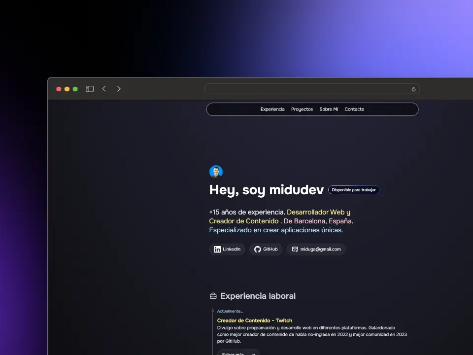

# 💼 Portfolio Personal - José Daniel López

<div align="center">
  
  
  **Un portfolio web moderno con diseño de terminal interactivo**
  
  [](https://tab-to-dev.click/jose-portfolio)
  
  
  
  
  [🌐 Ver Portfolio](https://tab-to-dev.click/jose-portfolio) • [📧 Contacto](mailto:jose@example.com) • [💼 LinkedIn](https://linkedin.com/in/jose-daniel-lopez)

</div>

## 📖 Descripción

Portfolio web personal desarrollado con **Astro** y **Tailwind CSS**, presentando una interfaz única inspirada en terminal de comandos. El sitio web muestra mi experiencia profesional, proyectos destacados, educación y habilidades técnicas de una manera interactiva y moderna.

### ✨ Características Principales

- 🖥️ **Interfaz de Terminal**: Experiencia de usuario única con animaciones de escritura
- 📱 **Diseño Responsivo**: Optimizado para todos los dispositivos
- ⚡ **Alto Rendimiento**: Construido con Astro para máxima velocidad
- 🎨 **Temas Múltiples**: Soporte para diferentes esquemas de color
- 🔧 **Componentes Modulares**: Arquitectura escalable y mantenible
- 📄 **SEO Optimizado**: Meta tags y estructura semántica
- ♿ **Accesible**: Cumple con estándares de accesibilidad web

## 🚀 Demo en Vivo

Visita el portfolio en: **[https://tab-to-dev.click/jose-portfolio](https://tab-to-dev.click/jose-portfolio)**

## 🛠️ Tecnologías Utilizadas

| Tecnología | Versión | Propósito |
|------------|---------|-----------|
| [Astro](https://astro.build/) | 4.4.5 | Framework principal |
| [Tailwind CSS](https://tailwindcss.com/) | 3.4.17 | Estilos y diseño |
| [TypeScript](https://www.typescriptlang.org/) | 5.3.3 | Tipado estático |
| [WebTUI](https://webtui.com/) | 0.1.4 | Componentes de terminal |

### 📦 Dependencias Adicionales

- **@astrojs/tailwind**: Integración oficial de Tailwind con Astro
- **@fontsource-variable/onest**: Fuente tipográfica moderna
- **astro-robots-txt**: Generación automática de robots.txt
- **Temas WebTUI**: Catppuccin, Everforest, Gruvbox, Vitesse

## 🏗️ Instalación y Configuración

### Prerrequisitos

- [Node.js](https://nodejs.org/) v18.14.1 o superior
- [npm](https://www.npmjs.com/) o [pnpm](https://pnpm.io/) (recomendado)
- Git

### 📥 Instalación

1. **Clonar el repositorio**
   ```bash
   git clone https://github.com/Jose-Daniel-Lopez/personal-portfolio.git
   cd personal-portfolio
   ```

2. **Instalar dependencias**
   ```bash
   # Con npm
   npm install
   
   # Con pnpm (recomendado)
   pnpm install
   ```

3. **Configurar variables de entorno** (opcional)
   ```bash
   cp .env.example .env.local
   # Editar .env.local con tus configuraciones
   ```

### 🎯 Scripts Disponibles

```bash
# Desarrollo - Servidor local con hot reload
npm run dev
# o
pnpm dev

# Construcción - Genera archivos para producción
npm run build
# o
pnpm build

# Vista previa - Sirve la versión de producción localmente
npm run preview
# o
pnpm preview

# Verificación - Ejecuta el type checking de TypeScript
npm run astro check
# o
pnpm astro check
```

### 🌐 Desarrollo Local

Después de la instalación, ejecuta:

```bash
pnpm dev
```

El sitio estará disponible en: `http://localhost:4321/jose-portfolio`

## 📁 Estructura del Proyecto

```
portfolio/
├── 📂 public/                 # Archivos estáticos
│   ├── favicon.svg           # Icono del sitio
│   ├── me.png               # Foto personal
│   └── projects/            # Imágenes de proyectos
├── 📂 src/                   # Código fuente
│   ├── 📂 assets/           # Recursos (CSS, archivos)
│   │   ├── css/            # Estilos globales
│   │   └── cv/             # Curriculum vitae
│   ├── 📂 components/       # Componentes Astro
│   │   ├── icons/          # Iconos SVG
│   │   ├── Hero.astro      # Sección principal
│   │   ├── Projects.astro  # Proyectos destacados
│   │   ├── Experience.astro # Experiencia laboral
│   │   └── Studies.astro   # Formación académica
│   ├── 📂 layouts/          # Plantillas de página
│   └── 📂 pages/            # Páginas del sitio
├── astro.config.mjs         # Configuración de Astro
├── tailwind.config.mjs      # Configuración de Tailwind
├── tsconfig.json           # Configuración de TypeScript
└── package.json            # Dependencias y scripts
```

## 🎨 Personalización

### Modificar Contenido Personal

1. **Información personal**: Edita `src/components/Hero.astro`
2. **Proyectos**: Actualiza `src/components/Projects.astro`
3. **Experiencia**: Modifica `src/components/Experience.astro`
4. **Educación**: Cambia `src/components/Studies.astro`

### Cambiar Temas

El proyecto incluye múltiples temas de WebTUI. Para cambiar el tema, edita las importaciones en el layout principal.

### Configurar Base Path

Para desplegar en un subdirectorio (como GitHub Pages), modifica `astro.config.mjs`:

```javascript
export default defineConfig({
  base: '/tu-repositorio',
  // ...resto de configuración
})
```

## 🚀 Despliegue

### GitHub Pages

1. Configura el workflow de GitHub Actions (incluido en `.github/`)
2. Habilita GitHub Pages en la configuración del repositorio
3. Los cambios se desplegarán automáticamente

### Netlify / Vercel

1. Conecta tu repositorio
2. Configura el comando de build: `npm run build`
3. Directorio de salida: `dist`

### Servidor Propio

```bash
# Construir para producción
pnpm build

# Los archivos estarán en el directorio 'dist/'
# Sirve estos archivos con cualquier servidor web
```

## 🤝 Contribuciones

Las contribuciones son bienvenidas. Para contribuir:

1. Fork el proyecto
2. Crea una rama para tu feature (`git checkout -b feature/AmazingFeature`)
3. Commit tus cambios (`git commit -m 'Add: Amazing Feature'`)
4. Push a la rama (`git push origin feature/AmazingFeature`)
5. Abre un Pull Request

## 📝 Licencia

Este proyecto está bajo la Licencia MIT. Ver el archivo [LICENSE.md](LICENSE.md) para más detalles.

## 👨‍💻 Sobre el Autor

**José Daniel López** - Full Stack Web Developer

- 💼 **Experiencia**: 15+ años en desarrollo web
- 🎯 **Especialización**: Aplicaciones web modernas y escalables
- 📍 **Ubicación**: España
- 📧 **Email**: [Contacto](mailto:jose@example.com)
- 💼 **LinkedIn**: [Perfil Profesional](https://linkedin.com/in/jose-daniel-lopez)

### 🛠️ Stack Tecnológico

- **Frontend**: JavaScript, TypeScript, Vue.js, React, Astro
- **Backend**: Node.js, Spring Boot, APIs RESTful
- **Base de Datos**: MySQL, PostgreSQL, MongoDB
- **DevOps**: Docker, CI/CD, Git
- **Herramientas**: Tailwind CSS, Vite, Webpack

## 📊 Estadísticas del Proyecto

- **Componentes**: 20+ componentes reutilizables
- **Páginas**: Estructura SPA optimizada
- **Rendimiento**: Puntuación Lighthouse 95+
- **Accesibilidad**: WCAG 2.1 AA compliant

## 🔗 Enlaces Útiles

- [Documentación de Astro](https://docs.astro.build/)
- [Guía de Tailwind CSS](https://tailwindcss.com/docs)
- [WebTUI Components](https://webtui.com/)
- [TypeScript Handbook](https://www.typescriptlang.org/docs/)

---

<div align="center">
  
  **⭐ Si te gusta este proyecto, considera darle una estrella en GitHub**
  
  Hecho con ❤️ por [José Daniel López](https://github.com/Jose-Daniel-Lopez)

</div>
